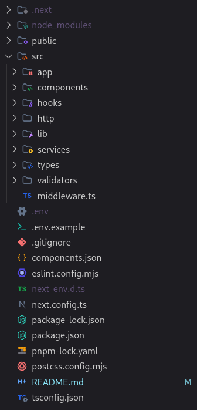

# Moritmitsu Dashboard - Frontend

# Requisitos

- Node.js >= 22.x
- PNPM ou NPM >= 10.x

## Estrutura do projeto



## Getting Started

1 - Clone o repositório:

```bash
git clone https://github.com/ismael-henrique-dev/Moritmitsu-Dashboard.git
```

2 - Caso não esteja no diretório do projeto, entre acessando:

```bash
cd Moritmitsu-Dashboard
```

3 - Instale as dependências:

```bash
pnpm i
# ou
npm i
```

4 - Crie um arquivo na raíz do projeto chamado `.env` e cole a variável que está em `.env.example`:

```env
API_URL="https://morimitsu-dashboard-api.onrender.com"
```

5 - Inicialize o servidor:

```bash
npm run dev
# or
yarn dev
# or
pnpm dev
# or
bun dev
```

6 - Abra [https://moritmitsu-dashboard.vercel.app](https://moritmitsu-dashboard.vercel.app) com seu navegador para ver o projeto rodando.

Você pode acessar o site hospedado também: [https://moritmitsu-dashboard.vercel.app](https://moritmitsu-dashboard.vercel.app).

